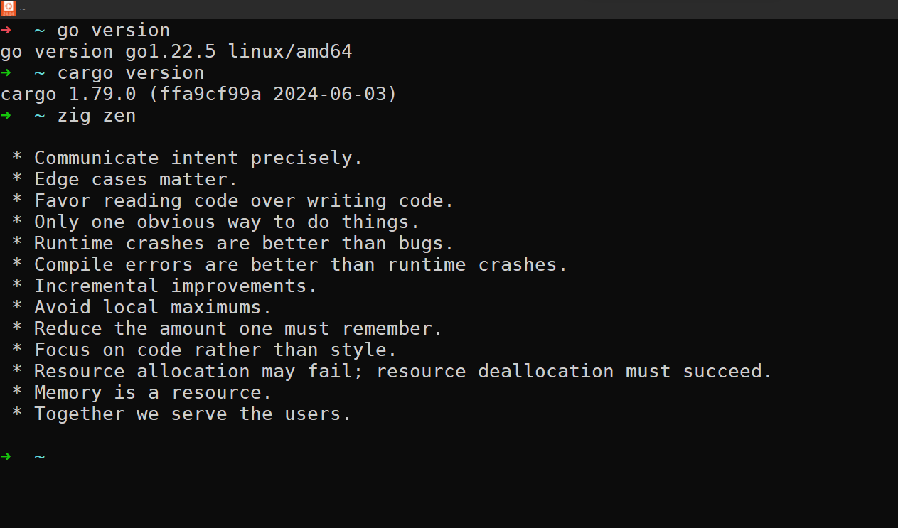

# WSL Ubuntu-24.04 Setup Guide



Follow these steps to set up Ubuntu-24.04 on Windows Subsystem for Linux (WSL):

### Step-by-Step Installation

1. **Update WSL and Install Ubuntu-24.04:**

    ```bash
    wsl --install Ubuntu-24.04
    ```

2. **Update Packages:**

    ```bash
    sudo apt update
    ```

3. **Install Build Essentials:**

    ```bash
    sudo apt install build-essential
    ```

4. **Install Dependencies (libssl-dev, libcurl4-openssl-dev):**

    ```bash
    sudo apt install -y libssl-dev libcurl4-openssl-dev
    ```

5. **Install Zsh:**

    ```bash
    sudo apt install zsh
    ```

6. **Install Oh My Zsh:**

    ```bash
    sh -c "$(wget https://raw.githubusercontent.com/ohmyzsh/ohmyzsh/master/tools/install.sh -O -)"
    ```

7. **Upgrade Installed Packages:**

    ```bash
    sudo apt upgrade -y
    ```

8. **Download and Install Go (Golang):**

    ```bash
    wget https://go.dev/dl/go1.22.5.linux-amd64.tar.gz
    sha256sum go1.22.5.linux-amd64.tar.gz
    sudo tar -C /usr/local -xvf go1.22.5.linux-amd64.tar.gz
    echo 'export PATH=$PATH:/usr/local/go/bin' >> ~/.zshrc && source ~/.zshrc
    go version
    ```

9. **Install Rust:**

    ```bash
    curl --proto '=https' --tlsv1.2 -sSf https://sh.rustup.rs | sh
    . "$HOME/.cargo/env"
    ```

10. **Verify Rust Installation:**

    ```bash
    rustc --version
    cargo --version
    ```

11. **Download and Install Zig:**

    ```bash
    wget https://ziglang.org/download/0.13.0/zig-linux-x86_64-0.13.0.tar.xz
    sudo tar -C /usr/local -xvf zig-linux-x86_64-0.13.0.tar.xz
    sudo mv /usr/local/zig-linux-x86_64-0.13.0.tar.xz /usr/local/zig
    echo 'export PATH=$PATH:/usr/local/zig' >> ~/.zshrc && source ~/.zshrc
    ```

### Verification

- **Verify Go Installation:**

    ```bash
    go version
    ```

- **Verify Zig Installation:**

    ```bash
    zig version
    ```

- **Verify Rust Installation:**

    ```bash
    rustc --version
    cargo --version
    ```
